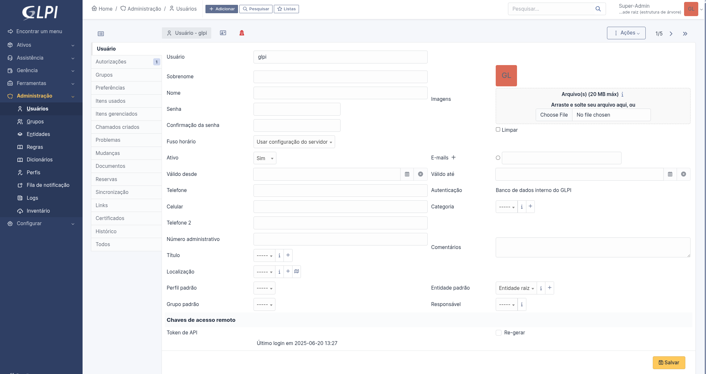

+++
title = "Instalação & Deploy do GLPI"
date = 2025-06-22
description = "Como instalar e fazer o deploy do software de TI GLPI"
+++

Se você é um técnico de TI que compõe ou lidera o time de uma empresa a plataforma GLPI pode ser de grande ajuda no seu dia a dia.

GLPI é um software de código aberto focado no gerenciamento de serviços de Suporte Técnico (Helpdesk) e ativos de TI, como computadores, servidores e licenças de software. Ele traz visibilidade para a sua operação e permite que seu time entenda quais são os gargalos dentro de cada processo, assim te capacitando à melhorar a qualidade dos serviço prestados tanto para colaboradores de outras áreas da empresa quanto para clientes externos. Ele também é de grande utilidade para tarefas administrativas, ajudando na criação de relatórios das atividades prestadas e do estado de toda a infraestrutura da organização.

Este tutorial tem como objetivo demonstrar como a instalação do GLPI pode ser feita para ambientes de teste, assim é possível entender se o software é adequado para a sua situação.

## Lista de materiais

Para instalar e configurar o software seguindo os passos a seguir, foram usados os seguintes itens:

- Servidor com o sistema operacional Linux Debian 12.

- Um servidor web, [Apache httpd 2.4](https://httpd.apache.org/) neste caso, para acesso ao GLPI

- [PHP 8.2](https://www.php.net/releases/8.2/en.php) para a interpretação do código PHP

- O sistema de gerenciamento de banco de dados [MariaDB](https://mariadb.org/)

- Os arquivos e código da versão [10.0.18 do GLPI](https://github.com/glpi-project/glpi/releases/tag/10.0.18)

- O pacote de software [wget](https://www.gnu.org/software/wget/) para o download do GLPI

- Um editor de texto para fazer as alterações necessárias nos arquivos

- O pacote de software [certbot](https://certbot.eff.org/) para a criação de certificados TLS

- Um [plugin do certbot](https://eff-certbot.readthedocs.io/en/latest/using.html#dns-plugins) para fazer o desafio DNS-01 (com este desafio o certbot consegue emitir certificados sem que o servidor esteja exposto à internet)

- [Python 3](https://www.python.org/) para instalar o certbot e suas dependências

Também é necessário o registro de um domínio web para concluir este guia. Será usado o [Cloudflare](https://www.cloudflare.com/pt-br/), um provedor de DNS dinâmico. Aqui você usaria o provedor do domínio registrado pela sua empresa. Caso sua intensão seja apenas testar o GLPI para uso pessoal, o provedor [DuckDNS](https://www.duckdns.org/) fornece domínios gratuitos.

## Passos

O processo de instalação é dividido no seguintes passos:

- [Preparar o servidor](@/blog/deploy-glpi/index.md#preparar-o-servidor)
- [Configurar o banco de dados](@/blog/deploy-glpi/index.md#configurar-o-banco-de-dados)
- [Preparar o ambiente para o GLPI](@/blog/deploy-glpi/index.md#preparar-o-ambiente-para-o-glpi)
- [Emitir o certificado TLS](@/blog/deploy-glpi/index.md#emitir-o-certificado-tls)
- [Finalizar a instalação](@/blog/deploy-glpi/index.md#finalizar-a-instalacao)
- [Pós instalação](@/blog/deploy-glpi/index.md#pos-instalacao)

## Preparar o servidor

Uma instalação básica de Debian 12 sem nenhum pacote extra é suficiente para instalar e configurar o GLPI. Recomendo a opção do servidor ssh se existir a necessidade de os próximos passos serem executados remotamente.

É importante atualizar todos os pacotes instalados.

```bash
sudo apt update && sudo apt upgrade -y
```

E garantir que as dependências básicas para o restante dos passos estejam presentes.

```bash
sudo apt install -y wget nano git tar
```

Os dados utilizados pelo GLPI são armazenados em um banco de dados SQL. MariaDB foi a ferramenta, com suporte, escolhida.

```bash
sudo apt install -y mariadb-server
```

Para que possamos acessar o website é necessário instalar um servidor web, já que o GLPI não é provido de um. Também precisamos de um
interpretador de código PHP para que o servidor entregue toda a informação proveniente do GLPI num formato que um navegar consiga processar.

Para isso devemos instalar os pacotes PHP e Apache2.

```bash
sudo apt install -y apache2 php
```

Também é preciso instalar módulos para funções específicas do GLPI que não são abrangidas pelo PHP básico. Juntamente a eles instalamos
um pacote para fazer a comunicação entre o servidor web e o interpretador PHP.

```bash
sudo apt install -y php-{xml,mbstring,bcmath,intl,zip,redis,bz2,cli}
sudo apt install -y php-{apcu,common,curl,gd,imap,ldap,mysql,xmlrpc}
sudo apt install -y libapache2-mod-php php-soap php-cas
```

O certificado TLS é gerado a partir de um pacote de software Python, o certbot, por tanto precisamos instalar essa linguagem. Venv é usado para isolar os demais pacotes Python dentro de um ambiente virtual, o pacote Augeas faz a comunicação do certbot com o Apache e gcc é usado para compilar algumas das dependências.

```bash
sudo apt install -y python3 python3-dev python3-venv libaugeas-dev gcc
```

## Configurar o banco de dados

Com o banco de dados instalado, um script pode ser utilizado para que sua configuração seja feita com mais segurança. Após o comando a seguir ser executado, bastar inserir a sequência de informações indicadas pelo script.

Escolha uma senha forte para o usuário root e siga as recomendações nos demais passos.

```bash
sudo mysql_secure_installation
```

O passo seguinte é liberar acesso à informação de fuso horário da máquina local para o servidor MariaDB. Isso, em conjunto com um passo mais adiante, permite que o GLPI acesse a informação de fuso horário de seus usuários.

```bash
mysql_tzinfo_to_sql /usr/share/zoneinfo | mysql mysql -u root -p
```

Agora é necessário acessar o servidor SQL para configurar o banco de dados que o software irá usar.

```bash
mysql -u root -p
```

Uma sequência de comandos é usada para isso. Substitua os valores encapsulados por **< >** por valores escolhidos por você, eles serão usados para concluir a configuração do GLPI e para alguma conexão posterior ao banco de dados por alguma outra ferramenta de agregação ou visualização de informação. Este acesso devera ser liberado, pois a configuração atual permite apenas conexões locais (localhost).

```sql
CREATE DATABASE <banco_de_dados>;
CREATE USER '<usuario>'@'localhost' IDENTIFIED BY '<senha>';
GRANT ALL PRIVILEGES ON <banco_de_dados>.* TO '<usuario>'@'localhost';
GRANT SELECT ON `mysql`.`time_zone_name` TO '<usuario>'@'localhost';
FLUSH PRIVILEGES;
EXIT;
```

## Preparar o ambiente para o GLPI

Com os pré-requisitos instalados, podemos fazer o download de todo o código fonte do GLPI para o servidor. É este código que será interpretado e depois
entregue para os usuários finais através de uma conexão de rede. Ele também controla a comunicação com o banco de dados e toda a lógica de
negócio do GLPI, e qualquer lógica adicional que pertence ao seu negócio específico e for configurada no software.

A versão do GLPI usada neste guia é a **10.0.18**, mas a versão mais atual pode ser encontrada na página oficial do GLPI no GitHub sob a tag
[latest](https://github.com/glpi-project/glpi/releases/latest).

É preciso baixar o código fonte de aplicativo e descompactar ele para que o processo possa continuar. O caminho padrão do Apache, **/var/www/html**, é usado.

```bash
cd /var/www/html
sudo wget https://github.com/glpi-project/glpi/releases/download/10.0.18/glpi-10.0.18.tgz
sudo tar -xvzf glpi-10.0.18.tgz
sudo rm glpi-10.0.18.tgz
```

Um servidor apache2 fornece, por padrão, acesso à todos os arquivos encontrados a partir do diretório que foi configurado como raiz de um aplicativo. Este comportamento não é ideal pois arquivos de configuração com dados confidenciais podem ser exibidos indevidamente. O GLPI tenta mitigar este comportamento, mas a melhor prática é mudar tais arquivos para outros diretórios.

Portanto, as pastas e arquivos de configuração, logs e arquivos que são criados durante o uso do GLPI serão movidas da pasta raiz do site.

```bash
sudo mv /var/www/html/glpi/config /etc/glpi
sudo mv /var/www/html/glpi/files /var/lib/glpi
sudo mv /var/lib/glpi/_log /var/log/glpi
```

As seguinte variáveis devem ser configuradas para redirecionar os caminhos padrão do GLPI para que estes arquivos possam ser encontrados.

- **GLPI_CONFIG_DIR**: caminho para o diretório com os arquivos de configuração;

- **GLPI_VAR_DIR** : caminho para o diretório com os arquivos usados e criados pelo GLPI;

- **GLPI_LOG_DIR** : caminho para os arquivos de log.

Dois arquivos de configuração devem ser criados para tais variáveis.

**downstream.php** define em qual caminho o GLPI irá procurar pelo diretório de configuração onde as demais configurações serão encontradas.

```bash
sudo nano /var/www/html/glpi/inc/downstream.php
```

```php
<?php
define('GLPI_CONFIG_DIR', '/etc/glpi/');
if (file_exists(GLPI_CONFIG_DIR . '/local_define.php')) {
    require_once GLPI_CONFIG_DIR . '/local_define.php';
}
```

**local_define.php** define em qual caminho o GLPI irá procurar pelos diretórios de log e arquivos.

```bash
sudo nano /etc/glpi/local_define.php
```

```php
<?php
define('GLPI_VAR_DIR', '/var/lib/glpi');
define('GLPI_LOG_DIR', '/var/log/glpi');
```

Como os arquivos foram movimentados para diretórios diferentes dos originais, precisamos atualizar o permissionamento dos diretórios atuais. Para isto, serão usados os comandos a seguir:

Mudar, recursivamente, o usuário e grupo proprietário para root.

```bash
sudo chown root:root /var/www/html/glpi/ -R
```

Mudar, recursivamente, o usuário e grupo proprietário para www-data.

```bash
sudo chown www-data:www-data /etc/glpi -R
sudo chown www-data:www-data /var/lib/glpi -R
sudo chown www-data:www-data /var/log/glpi -R
```

Mudar, recursivamente e com supressão de erros, o usuário e grupo proprietário para www-data.

```bash
sudo chown www-data:www-data /var/www/html/glpi/marketplace -Rf
```

Mudar o permissionamento dos arquivos, recursivamente, para rw-r--r--.

```bash
sudo find /var/www/html/glpi/ -type f -exec chmod 0644 {} \;
sudo find /etc/glpi -type f -exec chmod 0644 {} \;
sudo find /var/lib/glpi -type f -exec chmod 0644 {} \;
sudo find /var/log/glpi -type f -exec chmod 0644 {} \;
```

Mudar o permissionamento dos diretórios, recursivamente, para rwxr-xr-x.

```bash
sudo find /var/www/html/glpi/ -type d -exec chmod 0755 {} \;
sudo find /etc/glpi -type d -exec chmod 0755 {} \;
sudo find /var/lib/glpi -type d -exec chmod 0755 {} \;
sudo find /var/log/glpi -type d -exec chmod 0755 {} \;
```

Para que o servidor Apache entenda como servir o GLPI para os usuários que se conectarem, é necessário criar um arquivo de configuração. Inicialmente, ele estará configurado apenas para conexões HTTP, durante a emissão do certificado TLS em uma etapa futura, o **certbot** irá mudar este arquivo para que o Apache possa usar o certificado.

```bash
sudo nano /etc/apache2/sites-available/glpi.conf
```

```conf
# Início da configuração do VirtualHost para a porta 80
<VirtualHost *:80>
    # Especifique o nome do servidor que será resolvido para seu IP
    ServerName glpi.seudominio.com.br
    # O diretório raiz onde os arquivos do site estão localizados
    DocumentRoot /var/www/html/glpi/public
    # Início de uma diretiva Directory para /var/www/glpi/public
    <Directory /var/www/html/glpi/public>
        # Allow all access to this directory
        Require all granted
        # Habilite o mecanismo de reescrita do Apache
        RewriteEngine On
        # Garanta que os cabeçalhos de autorização sejam passados ​​para o PHP.
        # Algumas configurações do Apache podem filtrá-los e interromper o uso de API, CalDAV, ...
        RewriteCond %{HTTP:Authorization} ^(.+)$
        RewriteRule .* - [E=HTTP_AUTHORIZATION:%{HTTP:Authorization}]
        # Redirecione todas as solicitações para o roteador GLPI, a menos que o arquivo exista.
        RewriteCond %{REQUEST_FILENAME} !-f
        RewriteRule ^(.*)$ index.php [QSA,L]
    </Directory>
    # Fim da diretiva Directory para /var/www/glpi/public
</VirtualHost>
# Fim da configuração do VirtualHost para a porta 80
```

Após o arquivo ser criado, devemos habilitar ele junto ao Apache e fazer outras mudanças básicas.

```bash
# Desabilitar site apache padrão
sudo a2dissite 000-default.conf
# Habilitar o módulo de reescrita
sudo a2enmod rewrite
# Habilite as novas configurações do host virtual do Apache para sua instância glpi
sudo a2ensite glpi.conf
# Reiniciar o serviço para que as mudanças sejam implementadas
sudo systemctl restart apache2
```

Paro o melhor funcionamento do GLPI, devemos configurar o PHP com as boas práticas indicadas pela sua documentação.

- **upload_max_filesize**: O tamanho máximo para arquivos enviados é definido como 20 megabytes.
- **post_max_size**: O tamanho máximo para dados POST (por exemplo, envios de formulários) também é definido como 20 megabytes.
- **max_execution_time**: O tempo máximo de execução para um script PHP é definido como 60 segundos.
- **max_input_vars**: O número máximo de variáveis ​​de entrada (por exemplo, campos de formulário) que um script pode aceitar definido como 5000.
- **memory_limit**: A quantidade máxima de memória que um único script PHP pode usar é 256 megabytes.
- **session.cookie_httponly**: Define o atributo "HttpOnly" para cookies de sessão como verdadeiro.
- **session.cookie_secure**: Define se cookies de sessão serão enviados apenas por conexões seguras como verdadeiro.
- **date.timezone**: Define o fuso horário padrão do PHP para o seu.

O comando sed é usado para facilitar essas mudanças.

Caso alguma mudança seja feita neste comando, se atente nos caracteres **"\\"**. Eles são usados para negar caracteres de comando, como o **"."**, na sintaxe regex. Assim eles são tratados como caracteres comuns.

```bash
sudo sed -i -r 's/;?upload_max_filesize =.*/upload_max_filesize = 20M/g' /etc/php/8.2/apache2/php.ini
sudo sed -i -r 's/;?post_max_size =.*/post_max_size = 20M/g' /etc/php/8.2/apache2/php.ini
sudo sed -i -r 's/;?max_execution_time =.*/max_execution_time = 60/g' /etc/php/8.2/apache2/php.ini
sudo sed -i -r 's/;?max_input_vars =.*/max_input_vars = 5000/g' /etc/php/8.2/apache2/php.ini
sudo sed -i -r 's/;?memory_limit =.*/memory_limit = 256M/g' /etc/php/8.2/apache2/php.ini
sudo sed -i -r 's/;?session\.cookie_httponly =.*/session\.cookie_httponly = On/g' /etc/php/8.2/apache2/php.ini
sudo sed -i -r 's/;?session\.cookie_secure =.*/session\.cookie_secure = On/g' /etc/php/8.2/apache2/php.ini
sudo sed -i -r 's/;?date\.timezone =.*/date\.timezone = America\/Sao_Paulo/g' /etc/php/8.2/apache2/php.ini
```

## Emitir o certificado TLS

Para que a comunicação entre os usuários e o servidor que hospeda o GLPI seja segura, deve ser usado um certificado TLS para encriptar os dados durante a sua transmissão. Isso resguarda seus usuários de uma série de ataques conhecidos.

Esse certificado deve ser criado por uma entidade com autoridade para emitir novos certificados, que têm sua confiabilidade assegurado a partir de seu certificado raiz conhecido. A autoridade [**Let's Encrypt**](https://letsencrypt.org/) fornece esse serviço gratuitamente, com o intuito de tornar a internet mais segura, já que a emissão destes certificados antes era uma barreira monetária.

O próximo passo é criar um ambiente Python virtual, para que as dependências instaladas a seguir fiquem isoladas do resto do sistema. Isso torna qualquer manutenção e controle de versão mais fácil.

```bash
sudo python3 -m venv /opt/certbot/
sudo /opt/certbot/bin/pip install --upgrade pip
```

Devemos instar algumas dependências para seguir com essa etapa, a principal delas, o certbot. Ele é uma ferramenta de código aberto que se comunica com os servidores da **Let's Encrypt** e determina se o domínio em questão é de posse do servidor onde ele está sendo executado. Isto pode ser feito de mais de uma maneira. Neste caso, será feito com um desafio DNS-01. Ele possibilita que o certificado seja emitido sem o requerimento de a porta 80 do servido estar acessível ao resto da internet.

Também são necessários dois [plugins](https://eff-certbot.readthedocs.io/en/latest/using.html#dns-plugins) do certbot, um que lida com as configurações do apache e outro que adiciona a capacidade de fazer o desafio DNS-01 com um domínio do [Cloudflare](https://www.cloudflare.com/pt-br/).

```bash
sudo /opt/certbot/bin/pip install certbot certbot-apache certbot-dns-cloudflare
```

Um link simbólico é criado para que o comando **certbot** possa ser usado como se o software tivesse sido instalado pelo sistema.

```bash
sudo ln -s /opt/certbot/bin/certbot /usr/bin/certbot
```

Para que o desafio de DNS possa ser feito pelo Certbot, informações específicas sobre a sua conta Cloudflare devem ser fornecidas. Aqui é usado um arquivo **.ini** para que o acesso a estas informações seja limitado ao usuário root, apenas em modo de leitura e execução.

```bash
sudo nano /etc/glpi/cloudflare.ini
```

```bash
dns_cloudflare_api_token = <sua-chaveapi-cloudflare>
```

```bash
sudo chmod 600 /etc/glpi/cloudflare.ini
```

O comando a seguir é usado para gerar o certificado TLS. O arquivos de configuração criado no passo anterior, junto ao domínio que você ou a sua empresa é dona são dois dos parâmetros. As demais configurações podem ser entendidas junto à documentação do [certbot](https://eff-certbot.readthedocs.io/en/stable/). Substitua os valores dentro das chaves **< >**.

```bash
sudo certbot \
 --non-interactive \
 --agree-tos \
 --email <EMAIL>\
 --preferred-challenges dns \
 --authenticator dns-cloudflare \
 --dns-cloudflare-credentials /etc/glpi/cloudflare.ini \
 --dns-cloudflare-propagation-seconds 360 \
 -d "<SEU_DOMINIO>" \
 -i apache
```

O certificado tem validade de 90 dias, é necessário renovar ele periodicamente. Para que isso seja feito automaticamente, é usado uma tarefa cron diária, que fica encarregada de checar se o certificado está prestes a vencer de de renova-lo.

```bash
sudo echo "0 0,12 * * * root \
    /opt/certbot/bin/python -c 'import random; import time; time.sleep(random.random() * 3600)' \
    && sudo certbot renew -q" | sudo tee -a /etc/crontab > /dev/null
```

Como o certbot e suas dependências estão em um ambiente virtual do Python, não podemos esquecer de atualizar eles com o resto do sistema. O seguinte comando deve ser usado:

```bash
sudo /opt/certbot/bin/pip install --upgrade certbot certbot-apache certbot-dns-cloudflare
```

## Finalizar a instalação

Para que possamos acessar o portal web de maneira segura na rede local, com o certificado TLS criado na etapa anterior, é necessário configurar o seu servidor DNS para resolver o domínio escolhido para o IP do servidor configurado. Assim podemos encontrar o site usando uma URL como <https://glpi.seudominio.com.br>.

Após acessar o site, basta seguir os passos apresentados pelo instalador no portal web para finalizar a configuração do software. Alguns deles são abordados com mais detalhes a seguir.

### Confirmar prontidão

Confirmar que o ambiente está preparado e que todas as dependências estão funcionando devidamente.


### Conexão com servidor SQL

Usar os parâmetros escolhidos na configuração do servidor SQL para estabelecer uma conexão localhost.


### Conexão com banco de dados

Selecionar o banco de dados criado para uso do GLPI.


### Instalação concluída

A instalação do GLPI foi concluída com sucesso!


## Pós instalação

Após terminar a configuração, faça login com o usuário **glpi** e senha **glpi**. No menu principal, um alerta nos informa que são necessárias mais algumas tarefas de configuração.


### Remover o script

Remova o script de instalação **install.php** usando o comando a seguir:

```bash
sudo rm /var/www/html/glpi/install/install.php
```

### Modificar senhas

Usando o painel à esquerda da tela, navegue até o menu de administração dos usuários. Então, selecione um dos usuários que deve ter a sua senha trocada.


Modifique a sua senha para uma senha segura. Depois faça isto para os outros usuários vulneráveis.



Permita ao GLPI acessar as configurações de fuso horário, isso é importante caso existam colaboradores ou clientes da sua empresa em fusos diferentes.

```bash
sudo php /var/www/html/glpi/bin/console  glpi:database:enable_timezones
```

## GLPI configurado

Agora vocês tem em mãos um ambiente GLPI instalado e preparado para uso.


